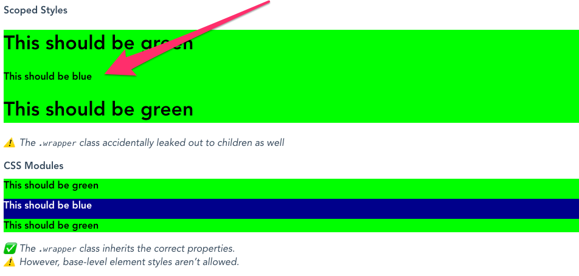
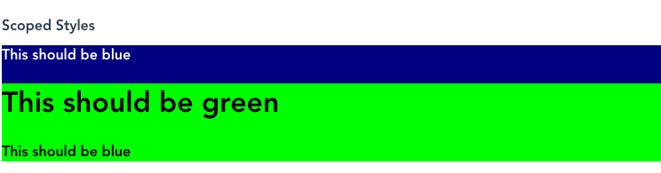
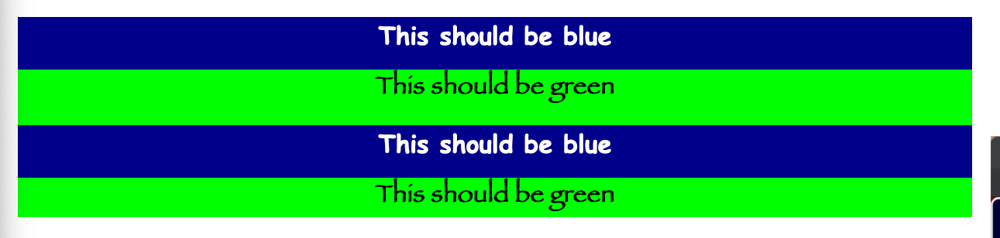

# Comparison of style implementations

## Vue

Vue has 2 options: `<style scoped>` and `<style module>`. However, upon closer inspection, scoped styles has a critical issue, and modules for the most part works nicely but with a caveat.

Imagine you have 2 components, one **blue** and one **green**. You nest these components inside each other. You‘re using scoped styles, so class names don’t matter … right? You reuse a `.wrapper` class for convenience:

```vue
<template>
  <div class="wrapper">
    <h1>This should be [blue | green]</h1>
    <slot />
  </div>
</template>

<style scoped>
.wrapper {
  background: [navy | lime];
}
</style>
```

However, when nesting these components inside one another:



You discove a critical flaw with `<style scoped>`: **you can’t reuse a classname along an entire document tree.** How are you supposed to know if a parent component has a `.wrapper`? How would you know that that will affect how your child component looks?

If that isn’t scary enough on its own, the bigger issue is that **order is random** 😱! In other words, if there is a conflict, there‘s no telling what will take priority. In our same example, what if you thought that the green component “won” because it was the parent? Nope!



The actual answer is that green always wins the conflict at random 🤷‍♂️. It has to do with the filename ordering. But in case you were thinking this, **no you can‘t come up with a filenaming pattern to address this.** The sad truth is that styles that cascade down to all children aren’t scoped at all.

Vue’s implementation of CSS modules does fix this, but with one big caveat: **base element styles do not work**. So if you wanted to, say, style `<h1>` tags only within that component, you couldn’t unless you gave it a class. Is that a dealbreaker? Well, actually, no. It’s trivial to add a CSS class, and it’s best practice anyway, both for scalable applications, as well as performance. Drew personally thinks this is a **feature** not a bug, but feel free to disagree there. Main takeaway is that **Vue‘s implementation of CSS Modules is adequate, and more viable than scoped CSS.**

## Svelte

Does Svelte fare any better? Why, yes, actually!


Though Svelte does implement a form of scoped CSS, it fixes all of Vue’s failings. It prevents styles from leaking into children, keeping them perfectly-encapsulated.

And it even beats Vue’s CSS Modules implementation, too: **you can style base elements as well** (shown here with base stylings for `<h1>` tags):



So, does Svelte’s implementation of styled CSS have any shortcomings? In short, **No!** Svelte’s implementation not only checks all the boxes, it does so in the most performant, best-practices way possible. Even CSS nerds can’t be mad about Svelte styles.
